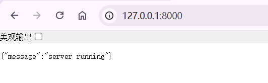
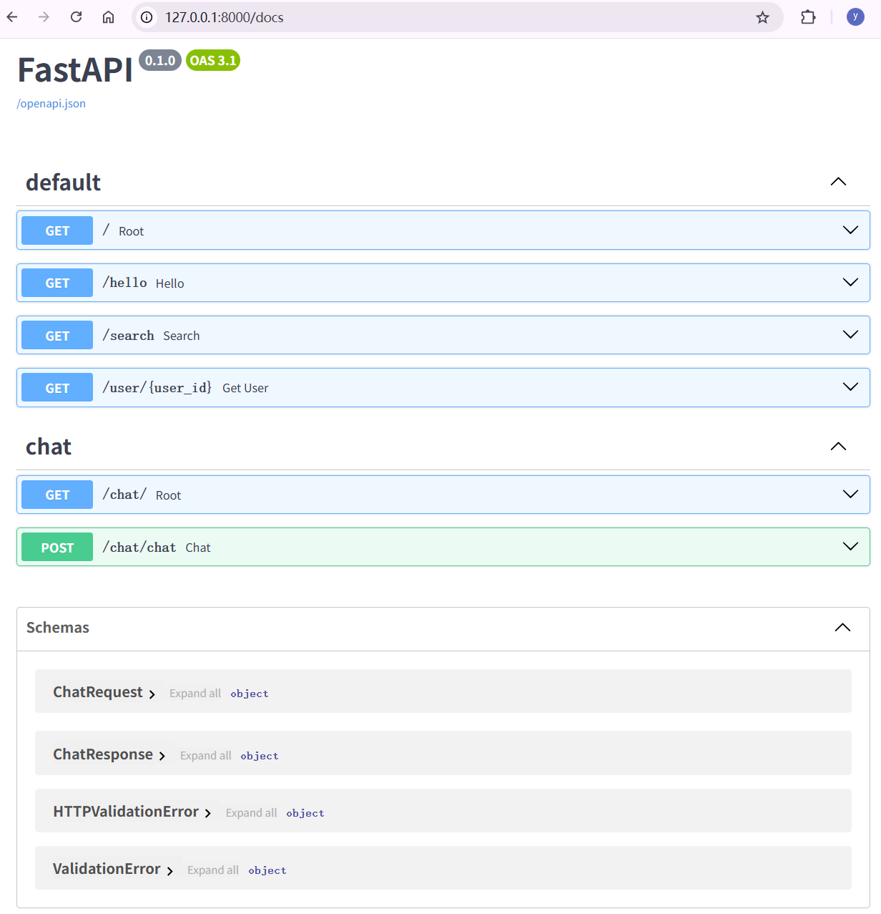

## 启动

```
# 创建虚拟环境
python -m venv .venv

# 安装依赖
python -m pip install -r requirements.txt

# 启动服务
uvicorn main:app --reload
```

访问 http://127.0.0.1:8000/



## 项目结构

```
backend/
│
├── main.py              ← FastAPI 应用入口
│
├── api/
│     chat.py            ← 路由（Route）
│
├── services/
│     ai_client.py       ← 调用 OpenAI
│     chat_service.py    ← 聊天业务
│
├── models/
│     schemas.py         ← Pydantic 模型
│
├── core/
│     config.py
│     logger.py
```

main.py 只负责三件事：

- 创建 FastAPI 应用
- 注册路由
- 做应用初始化（日志、配置、中间件等）

它只是**把整个应用组装起来**

## 整个调用链

```
浏览器
      │
      ▼
POST /chat
      │
      ▼
api/chat.py(Route)
      │
      ▼
ChatService(业务)
      │
      ▼
AIClient(OpenAI SDK)
      │
      ▼
OpenAI API
```

```
OpenAI API
      │
      ▼
AIClient
      │
      ▼
ChatService
      │
      ▼
Route
      │
      ▼
浏览器
```

## 核心思路

- `system prompt` 放在 prompts/system.md，不要写死在代码里。
- `多轮对话` 不应该由前端每次传一大堆历史，而是先由后端根据 conversation_id 管理。
- `聊天记录保存` 先用 JSON 文件实现，后面再替换成 SQLite / PostgreSQL。
- `流式输出` 先在后端用 FastAPI 的 StreamingResponse，前端再用 fetch 读取 stream
- `React 前端` 只负责输入、展示、调用 /chat 或 /chat/stream，不要放 AI 逻辑。

## 调用 DeepSeek API

DeepSeek API 使用与 OpenAI/Anthropic 兼容的 API 格式，通过修改配置，可以使用 OpenAI/Anthropic SDK 来访问 DeepSeek API

```python
# Please install OpenAI SDK first: `pip3 install openai`
import os
from openai import OpenAI

client = OpenAI(
    api_key=os.environ.get('DEEPSEEK_API_KEY'),
    base_url="https://api.deepseek.com")

response = client.chat.completions.create(
    model="deepseek-v4-pro",
    messages=[
        {"role": "system", "content": "You are a helpful assistant"},
        {"role": "user", "content": "Hello"},
    ],
    stream=False,
    reasoning_effort="high",
    extra_body={"thinking": {"type": "enabled"}}
)

print(response.choices[0].message.content)
```

https://api-docs.deepseek.com/zh-cn/

## 流式输出

流式输出的核心思想：生成器不断 yield 新的数据，StreamingResponse 每得到一个值就立即发送给客户端
